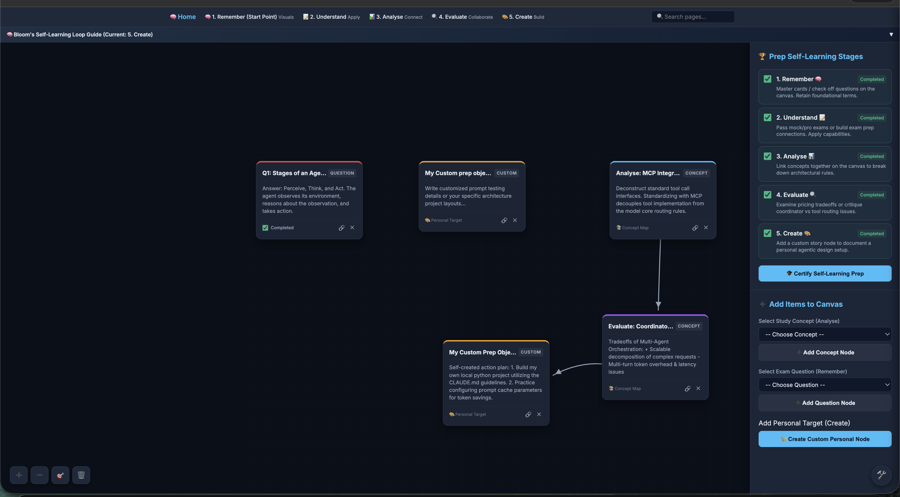
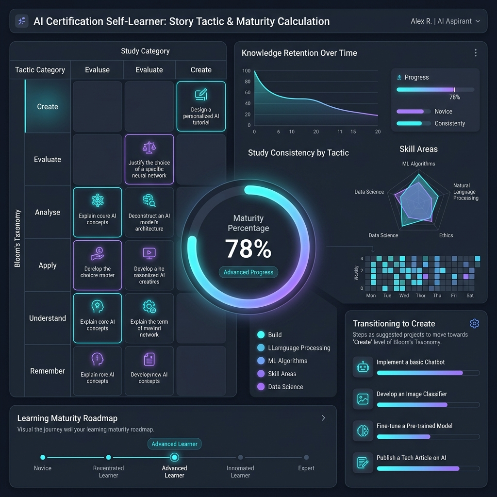
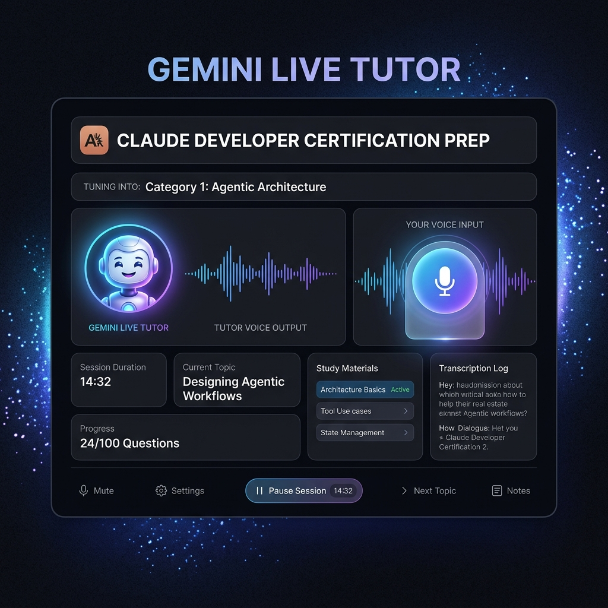

# 🎬 Master Simulation Document — The visual system architecture

This document coordinates and explains all UX/UI simulation mockups for the **Claude Developer Certification - Study Mastery App**. You can read this document directly within the [Markdown Notes Renderer](file:///Users/rifaterdemsahin/projects/claude_certification_exam/5_Symbols/pages/markdown_renderer.html?url=../../3_Simulation/master_simulation.md&title=Master%20Simulation).

---

## 🗺️ Visual Architecture Directory

The application's learning interface is designed around the principles of **Bloom's Taxonomy** and **Active Recall**. Below are the logical breakdowns and mockups of the four main system views.

---

### 📊 1. Study Dashboard (Active Recall Grid)
* **Image:** `study_dashboard.png`
* **Direct Render:** 
* **Logical Explanation:**
  * **Symptom / Needs:** Developers need to quickly assess their overall certification readiness across 100 questions and 5 distinct competency categories without getting overwhelmed.
  * **UX Rationale:** By displaying a dense grid of 100 interactive nodes, the dashboard leverages the **Zeigarnik Effect** (remembering uncompleted tasks). Colors denote status: red for weak, yellow for hard, and green for mastered.
  * **Interactive Workflow:** Hovering highlights details of the question; clicking a cell directly opens the Flashcard Recall View for targeted training.

---

### 🗺️ 2. Memory Palace Mindmap (Conceptual Mapping)
* **Image:** `memory_palace_mindmap.png`
* **Direct Render:** 
* **Logical Explanation:**
  * **Symptom / Needs:** Deep comprehension of tool configuration (MCP), client-server relations, and orchestration flows requires understanding connections rather than isolated facts.
  * **UX Rationale:** Leverages **Dual-Coding Theory** by overlaying visual nodes with semantic text tags.
  * **Interactive Workflow:** Nodes can be panned, zoomed, or double-clicked to load detailed concept docs in the Markdown Renderer.

---

### 🧠 3. Flashcard Recall View (The feedback loop)
* **Image:** `flashcard_recall_view.png`
* **Direct Render:** 
* **Logical Explanation:**
  * **Symptom / Needs:** The actual review step where self-assessment and visual cues help encode information into long-term memory.
  * **UX Rationale:** Forces retrieval practice. Employs SVG hints and emoji mnemonics to trigger visual memory anchors before answers are revealed. Save status in local cookies to feed the Spaced Repetition engine.
  * **Interactive Workflow:** Select multiple choices, look at visual schemas if stuck, grade yourself (Weak, Hard, Mastered) to update cookies.

---

### 📖 4. Story Canvas (Merging All Stages)
* **Image:** `story_creation_to_merge_all_stages.png`
* **Direct Render:** 
* **Logical Explanation:**
  * **Symptom / Needs:** Learners need a narrative context or a "story" to weave dry technical standards (like pricing, limits, or system prompts) into memorable scenarios.
  * **UX Rationale:** Maps the 7 delivery stages (Real Unknown, Environment, Simulation, Formula, Symbols, Semblance, Testing Known) into a vertical visual timeline, combining personal narratives with technical requirements.
  * **Interactive Workflow:** The timeline scroll reveals the sequential execution of stages, visually mapping how ideas transform into tested production features.

---

### 📈 5. Story Tactic & Maturity Calculation (Learning Progression)
* **Image:** `story_tactic_maturity.png`
* **Direct Render:** 
* **Logical Explanation:**
  * **Symptom / Needs:** Self-learners often get stuck at lower cognitive levels (Remember/Understand) and need structured guidelines and clear calculations to progress to the "Create" (design and build) stage.
  * **UX Rationale:** Visualizes a structured "Learning Maturity Roadmap" (Novice -> Re-centered -> Advanced -> Innovative -> Expert) alongside a radar chart of skill areas (Ethics, ML, NLP, Data Science) and a list of recommended transition projects. Uses a radial gauge to represent overall "Maturity Percentage" (e.g. 78% Maturity) to gamify and track higher-order learning capabilities.
  * **Interactive Workflow:** Check off completed learning projects (e.g., "Implement a basic Chatbot", "Fine-tune a Pre-trained Model") to automatically increment the maturity calculation and advance along the maturity roadmap.

### 🎙️ 6. Gemini Live Audio Tutor (Interactive Audio Session)
* **Image:** `gemini_live_audio_tutor.png`
* **Direct Render:** 
* **Logical Explanation:**
  * **Symptom / Needs:** Developers need hands-free, high-bandwidth interaction to practice explaining concepts out loud (Active Recall via verbal explanation) while multitasking or doing focused mock interviews.
  * **UX Rationale:** Leverages a live audio interface powered by Gemini Live. The layout features visual waveform queues, speech-to-text transcript logs, real-time latency indicators, and quick-toggle mute/pause buttons, maximizing flow state and mimicry of a real technical interview.
  * **Interactive Workflow:** Start a voice session, speak back-and-forth in real-time with the tutor, receive audio feedback and corrections, and review auto-generated textual notes afterward.

---

## 🔗 Quick Navigation Links

Use the local markdown renderer to read and study all simulation materials:
- 📖 [Master Simulation Guide](file:///Users/rifaterdemsahin/projects/claude_certification_exam/5_Symbols/pages/markdown_renderer.html?url=../../3_Simulation/master_simulation.md&title=Master%20Simulation) (this page)
- 📱 [User Experience Guide](file:///Users/rifaterdemsahin/projects/claude_certification_exam/5_Symbols/pages/markdown_renderer.html?url=../../3_Simulation/user_experience.md&title=User%20Experience%20Guide)
- 🧠 [Memory Palace Prompts](file:///Users/rifaterdemsahin/projects/claude_certification_exam/5_Symbols/pages/markdown_renderer.html?url=../../3_Simulation/memory_palace_prompt.md&title=Memory%20Palace%20Prompt)
